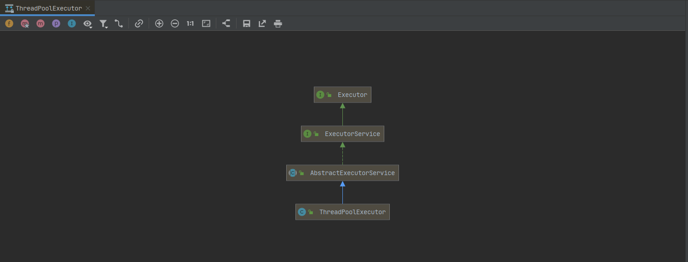

### ThreadPoolExecutor 线程池

> 起初，学习并发方面的知识单纯只是为了面试，因为项目中基本用不到，理解的也并不多；现在的项目中刚好有并发场景，所以写这篇笔记来巩固一下并发方面的知识。


概述：线程池的三大方法、七大参数、四种拒绝策略

- 三大方法

  ~~~java
  public static void main(String[] args) {
  	// 请求多的话就创建线程多
      Executors.newCachedThreadPool();
      // 给定线程的线程池
      Executors.newFixedThreadPool();
      // 只有单个线程
      Executors.newSingleThreadExecutor();
  }
  ~~~

- 七大参数

  ~~~java
  /*
  corePoolSize: the number of threads to keep in the pool, even if they are idle, unless {@code allowCoreThreadTimeOut} is set.
      
  maximumPoolSize: the maximum number of threads to allow in the pool.
      
  keepAliveTime: when the number of threads is greater than the core, this is the maximum time that excess idle threads will wait for new tasks before terminating.
  
  unit: the time unit for the {@code keepAliveTime} argument.
  
  workQueue: the queue to use for holding tasks before they are executed.  This queue will hold only the {@code Runnable} tasks submitted by the {@code execute} method.
  
  handler: the handler to use when execution is blocked because the thread bounds and queue capacities are reached.
  
  threadFactory: the factory to use when the executor creates a new thread.
  */
  
  corePoolSize: 线程池核心线程个数
  workQueue: 用于保存等待执行任务的阻塞队列
  maximunPoolSize: 线程池最大线程数量
  ThreadFactory: 创建线程的工厂
  RejectedExecutionHandler: 队列满，并且线程达到最大线程数量的时候，对新任务的处理策略
  keeyAliveTime: 空闲线程存活时间
  TimeUnit: 存活时间单位
  ~~~

- 四种拒绝策略

  ~~~java
  ThreadPoolExecutor.AbortPolicy：丢弃任务并抛出 RejectedExecutionException 异常。这是线程池默认的拒绝策略,在任务不能再提交的时候,抛出异常,及时反馈程序运行状态。如果是比较关键的业务, 推荐使用此拒绝策略,这样子在系统不能承载更大的并发量的时候,能够及时的通过异常发现。
      
  ThreadPoolExecutor.DiscardPolicy: 丢弃任务,但是不抛出异常。使用此策略,可能会使我们无法发现系统的异常状态。建议是一些无关紧要的业务采用此策略。 
  
  ThreadPoolExecutor.DiscardOldestPolicy: 丢弃队列最前面的任务,然后重新提交被拒绝的任务。是否要采用此种拒绝策略,还得根据实际业务是否允许丢弃老任务来认真衡量。 
  
  ThreadPoolExecutor.CallerRunsPolicy：由调用线程(提交任务的线程)处理该任务。这种情况是需要让所有任务都执行完毕, 那么就适合大量计算的任务类型去执行,多线程仅仅是增大吞吐量的手段,最终必须要让每个任务都执行完毕。
  ~~~

- 线程池用来解决什么问题？
  
  - 线程池所解决的是计算机资源管理问题。因为在一些并发场景下，未使用线程池的程序性能不太好，用户体验非常差。
- 线程池的设计及实现
  
  - 通过多线程运作提高用户体验，而线程池就是用来管理线程的地方，其中会有创建线程，给线程分配资源，回收线程等等一系列操作...

ThreadPoolExecutor 的类图如下：



与此（多线程）相关的还有 ScheduledExecutorService，ExecutorService 等等，以后再介绍。

- 先介绍 ctl，注释已说明，此变量具有原子性，类型为 AtomicInteger，它的值由 workerCount 和 runState 构成，它用来计算 workerCount 和 runState，计算方法见方法 runStateOf(int c), workerCountOf(int c), ctlOf(int rs, int wc)：
  - workerCount : 线程数量
  - runState : 运行状态

~~~java
  这里只摘取 ctl 变量的部分注释：
	/**
    * The main pool control state, ctl, is an atomic integer packing
    * two conceptual fields
    *   workerCount, indicating the effective number of threads
    *   runState,    indicating whether running, shutting down etc
    *
    * In order to pack them into one int, we limit workerCount to
    * (2^29)-1 (about 500 million) threads rather than (2^31)-1 (2
    * billion) otherwise representable. If this is ever an issue in
    * the future, the variable can be changed to be an AtomicLong,
    * and the shift/mask constants below adjusted. But until the need
    * arises, this code is a bit faster and simpler using an int.
    * /
    
	private final AtomicInteger ctl = new AtomicInteger(ctlOf(RUNNING, 0));
    private static final int COUNT_BITS = Integer.SIZE - 3;
    private static final int CAPACITY   = (1 << COUNT_BITS) - 1;

    // runState is stored in the high-order bits
    private static final int RUNNING    = -1 << COUNT_BITS;
    private static final int SHUTDOWN   =  0 << COUNT_BITS;
    private static final int STOP       =  1 << COUNT_BITS;
    private static final int TIDYING    =  2 << COUNT_BITS;
    private static final int TERMINATED =  3 << COUNT_BITS;
    
    // Packing and unpacking ctl
    private static int runStateOf(int c)     { return c & ~CAPACITY; }
    private static int workerCountOf(int c)  { return c & CAPACITY; }
    private static int ctlOf(int rs, int wc) { return rs | wc; }
~~~


 #### 线程池构造器

目前的项目中使用的线程池构造器如下：

~~~java
/*
目前项目中的参数设置为：
corePoolSize = Runtime.getRuntime().availableProcessors();
maximumPoolSize = 
keepAliveTime = 
unit = 
workQueue = LinkedBlockingQueue
threadFactory = 
*/
public ThreadPoolExecutor(int corePoolSize,
                          int maximumPoolSize,
                          long keepAliveTime,
                          TimeUnit unit,
                          BlockingQueue<Runnable> workQueue,
                          ThreadFactory threadFactory) {
    this(corePoolSize, maximumPoolSize, keepAliveTime, unit, workQueue,
         threadFactory, defaultHandler);
}
~~~

若构造器无 ThreadFactory 入参的时候，源码中的注释为：

```
Creates a new {@code ThreadPoolExecutor} with the given initial parameters and default thread factory and rejected execution handler.
It may be more convenient to use one of the {@link Executors} factory methods instead of this general purpose constructor.
```

简单说就是希望你能指定生产线程的参数，即传入 ThreadFactory 参数。


- 参考

  [Java 线程池实现原理及其在美团业务中的实践](https://tech.meituan.com/2020/04/02/java-pooling-pratice-in-meituan.html)